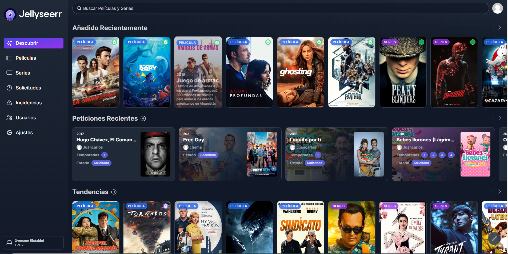
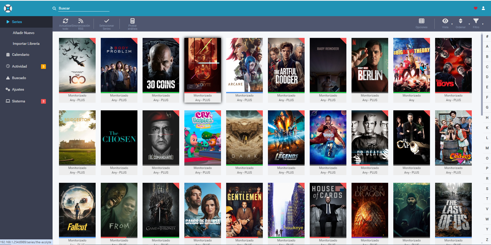
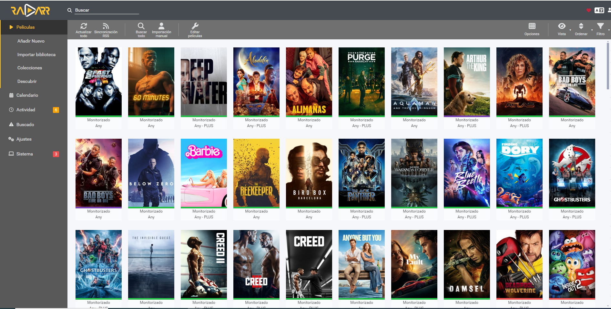

## Full Media Server Es_es
Con este stack de aplicaciones podemos tener un servidor de medios completamente automatizado, descargando todos los datos a traves de un proveedor VPN para mayor seguridad.

## Jellyseerr
Se conecta contra las API de sonarr y radarr nos da una interfaz web desde la cual podemos solicitar contenido a las plataformas.

## Sonarr
Sonarr es un PVR para usuarios de Usenet y BitTorrent. Puede monitorear múltiples fuentes RSS en busca de nuevos episodios de sus programas favoritos y los capturará, clasificará y les cambiará el nombre. También se puede configurar para actualizar automáticamente la calidad de los archivos ya descargados cuando esté disponible un formato de mejor calidad.

## Radarr
Radarr es un administrador de colección de películas para usuarios de Usenet y BitTorrent. Puede monitorear múltiples fuentes RSS en busca de nuevas películas e interactuará con clientes e indexadores para capturarlas, ordenarlas y cambiarles el nombre. También se puede configurar para actualizar automáticamente la calidad de los archivos existentes en la biblioteca cuando esté disponible un formato de mejor calidad. Tenga en cuenta que solo se admite un tipo de película determinada. Si desea una versión 4k y una versión 1080p de una película determinada, necesitará varias instancias.

